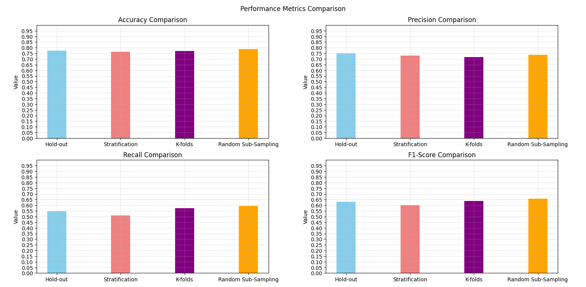

# Validation-Techniques-Comparison
Project that compare the performance of Logistic regression models given by different validation techniques: hold-out validation, stratification, k-fold cross validation, random subsampling.

The validation techniques that gave us best results for each metric are:
- Accuracy: Random sub-sampling
- Precision: Hold-out
- Recall: Random sub-sampling
- F1: Random sub-sampling

